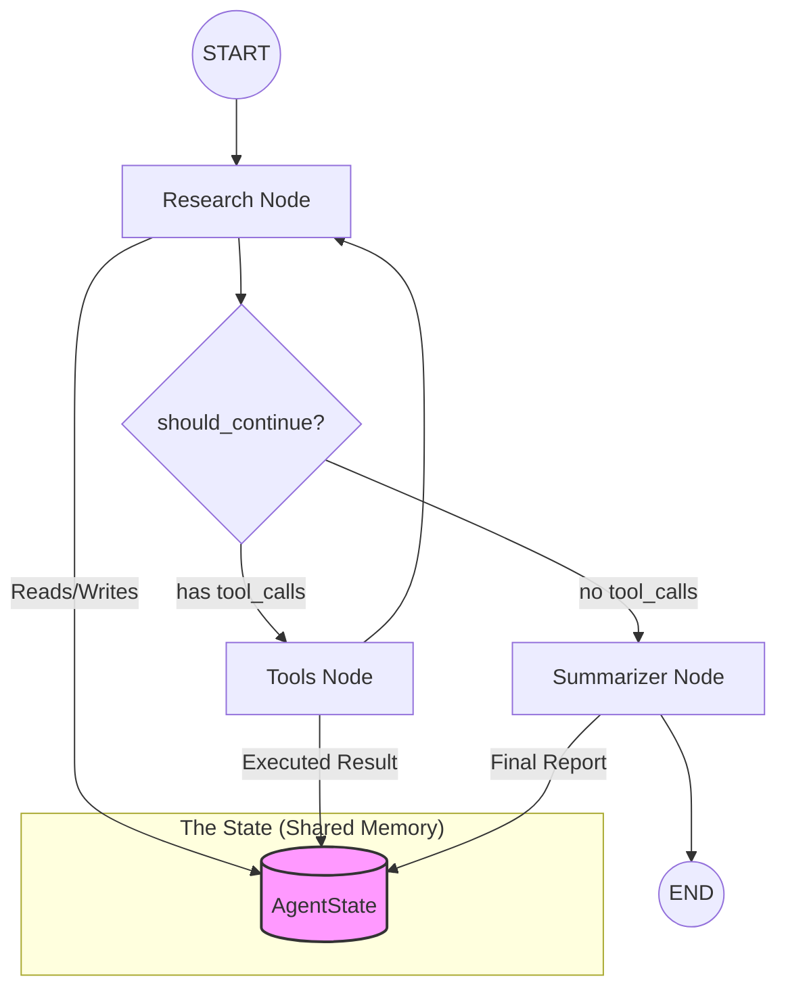

# Phase 5: LangGraph (The State Machine)

## Architecture Overview
This diagram shows how our Nodes travel along the Edges and update the Shared State.



LangGraph is built on top of LangChain to handle **stateful, multi-actor applications.** 

## 1. The Core Concept: State
In previous phases, each message was mostly independent. In LangGraph, we define a **State object** (usually a TypedDict) that acts as the shared memory for the entire process.

```python
class AgentState(TypedDict):
    messages: Annotated[Sequence[BaseMessage], operator.add]
    research_complete: bool
```

## 2. Nodes (The Workers)
Each Node is a function that:
1. Takes the **Current State** as input.
2. Does some work (like calling an LLM or a Tool).
3. Returns an **Update** to the state.

## 3. Edges (The Logic)
Edges connect the nodes.
- **Normal Edges**: Always go from Node A to Node B.
- **Conditional Edges**: The graph "decides" which way to go based on the state. 
    - *Example*: `If topic is 'crypto' -> go to CryptoExpertNode, else -> go to GeneralNode`.

## 5. Conditional Edges (The Router)
This is how the graph "decides" which way to go.

```python
workflow.add_conditional_edges(
    "source_node",       # Where we start
    routing_function,   # The function that checks the state
    {                   # Mapping of function output -> node names
        "path_a": "node_a",
        "path_b": "node_b"
    }
)
```
- **Source**: The node that just finished.
- **Path Logic**: Any function that takes `state` and returns a string.
- **Mapping**: Translates that string into the actual destination node.
